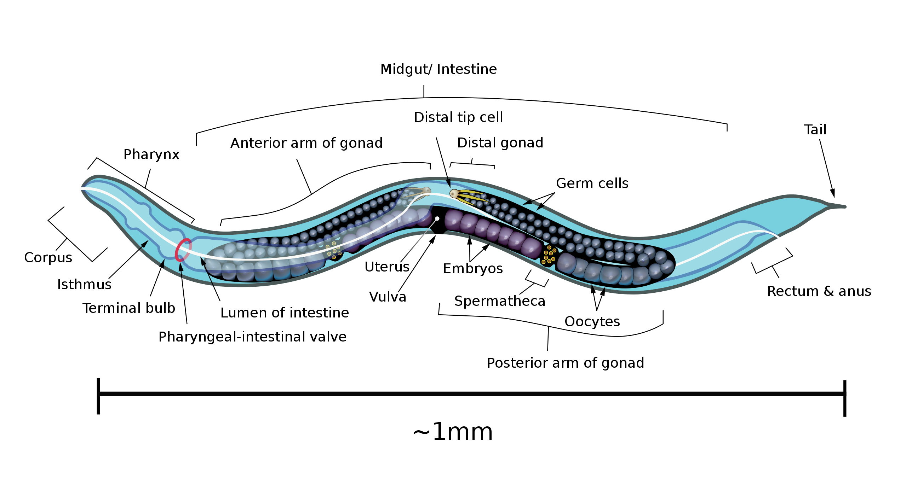
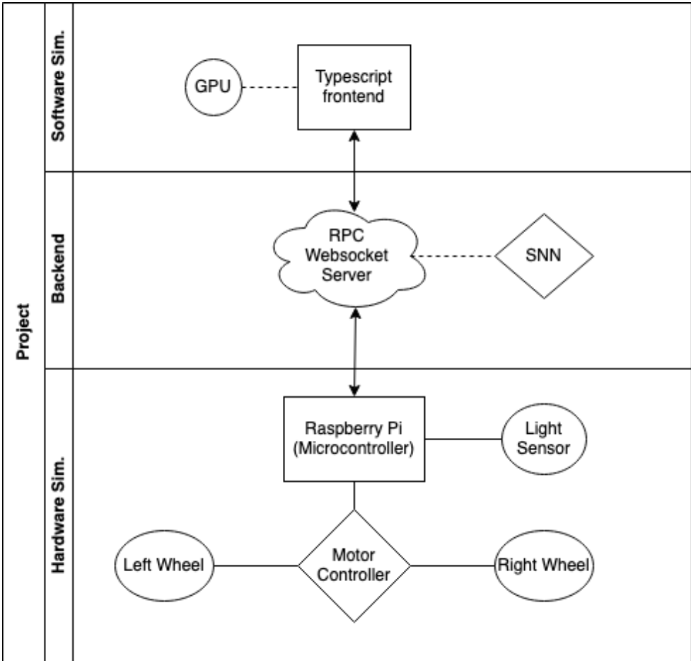

# FYP

### Introduction

With the advent of Neuromorphic Computing, and its subsequent growth in popularity and utility, the demand for computational solutions that extend beyond the Von-Neumann bot- tleneck is on the rise; we explore biologically inspired solution for spatial navigation inspired by C.Elegans. C.Elegans is considered as the fundamental organism in development biology and due to the simplicity of its mapped out genome, it is widely used as a foundation in experimental biology. It comprises of 302 neurons and approximately 5000 chemical synapses. The worm is capable of complex behaviours such as responding to external stimuli like heat and chemicals(chemotaxis). In this project we developed a spiking neural network(SNN) inspired by the thermotaxis behaviour of the worm to navigate physical environments based on tracking variables like heat or light intensity, which could find applicabiliy in real world robotic applications.

### Structure
Implementation of an end-to-end software and hardware based solution to simulate the thermotaxis behavior of the worm. For the software based solution, the worm engages in tracking thermal isotherms and in hardware this is simulated with light intensity tracking instead of temperature.

